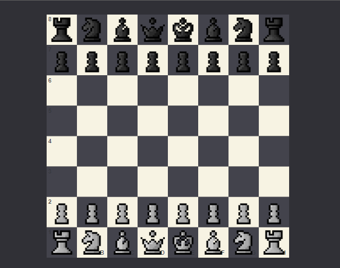

# ChessFrontend

This is the frontend of my [chess-engine](https://github.com/LarsAur/ChessEngine).
This is also an attempt at using [webassembly](https://webassembly.org/) to run the engine in the browser at near native speed.

#Play
You can play against my bot [here](https://larsaur.github.io/ChessFrontend/)

# Credits

Sprites are made by Lucas312 under the  [CC-BY 3.0](https://creativecommons.org/licenses/by/3.0/) license. The original source of the sprites: 
https://opengameart.org/content/pixel-chess-pieces
